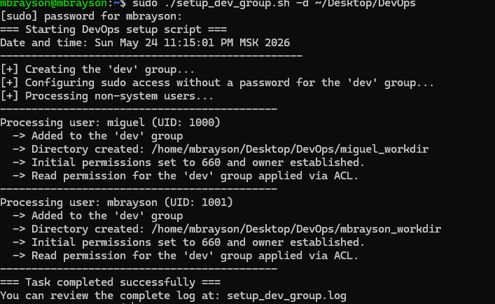
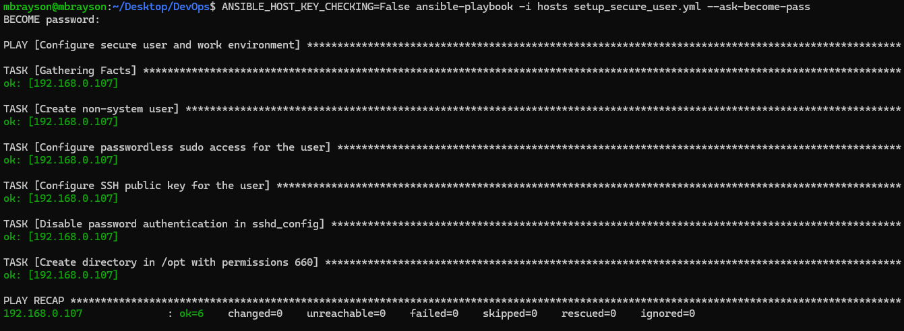

# Практические задания: Администрирование Linux (Bash) и Управление конфигурацией (Ansible)

Данный репозиторий содержит выполнение двух практических заданий по автоматизации разграничения прав доступа, управлению пользователями и обеспечению безопасности удаленного доступа.

## 1. Задание по Bash: Автоматизация управления пользователями и директориями

### 📝 Описание задания
Был разработан системный Bash-скрипт `setup_dev_group.sh`, предназначенный для автоматической настройки рабочей среды разработчиков. Скрипт выполняет следующие функции:
1. **Создание группы:** Автоматически инициализирует группу `dev`.
2. **Фильтрация несистемных пользователей:** Парсит файл `/etc/passwd`, находит всех реальных (несистемных) пользователей в системе (UID ≥ 1000, такие как `miguel` и `mbrayson`) и включает их в группу `dev`.
3. **Беспарольный sudo:** Настраивает привилегии в конфигурации sudoers для группы `dev` без необходимости ввода пароля.
4. **Конфигурация рабочих директорий:** Создает для каждого обработанного пользователя персональную папку по шаблону `<user_name>_workdir`.
5. **Флаги и интерактивность:** Путь для генерации директорий гибко управляется флагом `-d` (например, `~/Desktop/DevOps`). Если флаг отсутствует, скрипт запрашивает данные в интерактивном режиме.
6. **Права доступа и логирование:** Назначает на папки базовые права `660` (владелец и группа пользователя), расширяет доступ на чтение группе `dev` с помощью технологии ACL (`setfacl`), а весь вывод дублирует в поток stdout и лог-файл `setup_dev_group.log`.

### 🚀 Инструкция по запуску скрипта

# Выдача прав на исполнение скрипта
chmod +x setup_dev_group.sh

# Запуск с явным указанием пути до рабочих директорий
sudo ./setup_dev_group.sh -d ~/Desktop/DevOps

### 📊 Результат выполнения (Bash)

*Ниже представлена успешная работа скрипта, определяющего пользователей miguel и mbrayson, создающего папки и применяющего правила ACL:*

## 2. Задание по Ansible: Настройка безопасного удаленного доступа (SSH)

### 📝 Описание задания

Был написан Ansible-плейбук `setup_secure_user.yml` для автоматизированной настройки безопасности (hardening) целевого сервера. Сценарий автоматизирует 5 ключевых шагов:

1. **Управление пользователями:** Инициализирует новую учетную запись (несистемного пользователя) на удаленной машине.
2. **Повышение привилегий:** Добавляет созданного пользователя в список sudoers с беспарольным доступом.
3. **Безопасный SSH по ключам:** Импортирует публичный криптографический ключ в файл `authorized_keys` пользователя.
4. **Отключение небезопасной аутентификации:** Изменяет конфигурационный файл `sshd_config`, отключая авторизацию по стандартным паролям (`PasswordAuthentication no`).
5. **Выделенное хранилище:** Генерирует обособленную рабочую директорию внутри каталога `/opt/` с установкой строгих прав доступа `660`.

### 🚀 Инструкция по запуску Ansible

# Запуск плейбука на целевых хостах из инвентаря
ANSIBLE_HOST_KEY_CHECKING=False ansible-playbook -i hosts setup_secure_user.yml --ask-become-pass

### 📊 Результат выполнения (Ansible)
Процесс выполнения задач плейбука, где все целевые шаги успешно выполнены (статус ok=6, failed=0):

## 🔒 Краткое пояснение результатов (Выводы)

* Разработанный **Bash-скрипт** продемонстрировал высокую эффективность для выполнения локальных процедур, требующих парсинга локальных файлов (UID пользователей), гибкой потоковой обработки строк и логирования через `tee`.
* **Ansible Playbook** показал явные преимущества декларативного подхода IaC для сетевой безопасности. Модификация параметров демона SSH и массовый деплой публичных ключей происходят параллельно и гарантируют идентичное состояние безопасности на всех серверах инфраструктуры без ручного вмешательства.